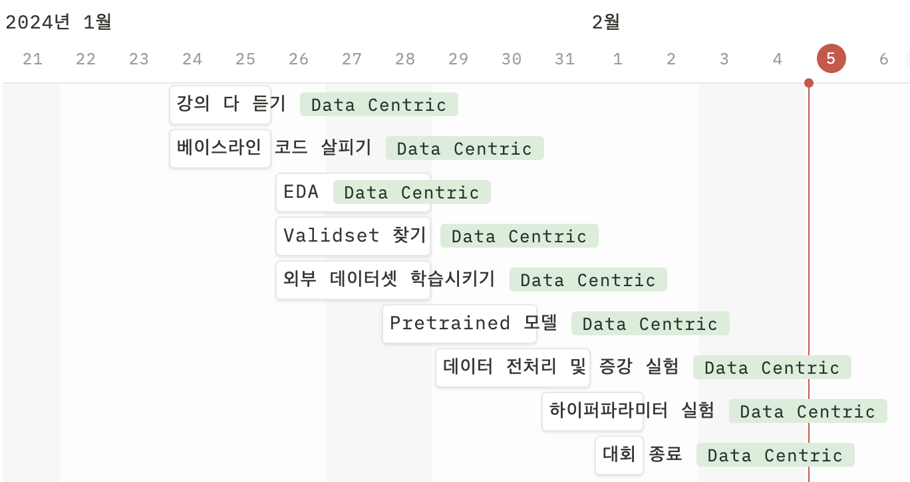
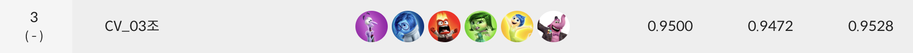
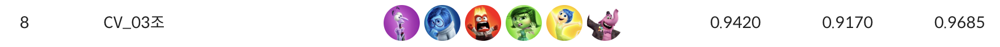

# 글자 검출 프로젝트 OCR

## 😊 팀 구성원
<div align="center">
<table>
  <tr>
    <td align="center"><a href="https://github.com/hyunseo-k"><br /><sub><b>강현서</b></sub><br />
    </td>
        <td align="center"><a href="https://github.com/Jungtaxi"><br /><sub><b>김정택</b></sub><br />
    </td>
        <td align="center"><a href="https://github.com/jinjero"><br /><sub><b>박진영</b></sub><br />
    </td>
        <td align="center"><a href="https://github.com/rudeuns"><br /><sub><b>선경은</b></sub><br />
    </td>
        <td align="center"><a href="https://github.com/rsl82"><br /><sub><b>이선우</b></sub><br />
    </td>
        <td align="center"><a href="https://github.com/ChoeHyeonWoo"><br /><sub><b>최현우</b></sub><br />
    </td>
  </tr>
</table>
</div>

<br />

## 😷 프로젝트 개요
학습 데이터 추가 및 수정을 통한 이미지 속 글자 검출 성능 개선 대회

<br />

## 📅 프로젝트 일정
프로젝트 전체 일정

- 2024.01.24 ~ 2024.02.01

프로젝트 세부 일정


<br />

## 🏆 프로젝트 결과
- Public 리더보드 결과


<br />
- Private 리더보드 결과


<br />

## 📁 데이터셋 구조
```
📦datasets
 ┗ 📂data
   ┗ 📂medical
     ┣ 📂img
     ┃ ┣ 📂train
     ┃ ┣ 📂train_crop
     ┃ ┗ 📂test
     ┗ 📂ufo
       ┣ 📜train.json
       ┗ 📜train_crop.json
```
이 코드는 `부스트캠프 AI Tech`에서 제공하는 데이터셋으로 다음과 같은 구성을 따릅니다.
- train은 학습에 사용하는 데이터셋
- test은 평가에 사용하는 데이터셋
- train_crop은 train 데이터에서 예측이 잘 안되는 이미지를 crop하여 저장한 데이터셋

<br />

## 📁 프로젝트 구조
```
📦level2-cv-datacentric-cv-03
 ┣ 📂.git
 ┣ 📂.github
 ┣ 📂aihub_utils
 ┃ ┣ 📜AIHub_format_to_competition.ipynb
 ┃ ┣ 📜coco2ufo.py
 ┃ ┣ 📜dataset.py
 ┃ ┣ 📜east_dataset.py
 ┃ ┗ 📜train.py
 ┣ 📂imgs
 ┃ ┣ 📜private_result.png
 ┃ ┣ 📜public_result.png
 ┃ ┗ 📜schedule.png
 ┣ 📂utils
 ┃ ┣ 📜crop_offline_augmentation.py
 ┃ ┣ 📜offline_augmentation.ipynb
 ┃ ┣ 📜qr.csv
 ┃ ┣ 📜random_split.py
 ┃ ┣ 📜show_data.py
 ┃ ┣ 📜show_difference.py
 ┃ ┗ 📜show_inference.py
 ┣ 📜.gitignore
 ┣ 📜.pre-commit-config.yaml
 ┣ 📜README.md
 ┣ 📜bboxes_dict.py
 ┣ 📜dataset.py
 ┣ 📜detect.py
 ┣ 📜deteval.py
 ┣ 📜east_dataset.py
 ┣ 📜inference.py
 ┣ 📜loss.py
 ┣ 📜metric.py
 ┣ 📜model.py
 ┣ 📜requirements.txt
 ┗ 📜train.py
```

#### 1) `dataset.py`
- Augmentation를 적용한 base dataset을 구현한 파일
#### 2) `east_dataset.py`
- base dataset을 받아서 score_map, geo_map을 반환하는 dataset 파일
#### 3) `loss.py`
- dice loss, geo loss를 계산하는 EASTLoss를 정의한 파일
#### 4) `model.py`
- 학습에 사용되는 EAST Model 클래스를 구현한 파일
- Extractor로는 VGG16을 사용하며 merge와 output을 거쳐 score_map과 geo_map을 반환
#### 5) `train.py`
- Argument 값을 통해 학습 파라미터들을 불러오고 train하는 파일
#### 6) `inference.py`
- 학습 완료된 모델을 통해 test set에 대한 예측 값을 구하고 이를 .csv 형식으로 저장하는 파일
#### 7) `detect.py`
- test set 이미지에 대한 infernece를 진행하여 score_map과 geo_map을 예측하고 bbox 좌표를 반환하는 파일
#### 8) `deteval.py`
- precision, recall, f1score를 계산하는 파일
#### 9) `metric.py`
- validation set에 대한 score_map과 geo_map을 입력받아 bbox 좌표를 반환하는 파일
#### 10) `bboxes_dict.py`
- validation set의 예측 bbox와 gt bbox를 반환하는 파일

<br />

## ⚙️ requirements

- lanms==1.0.2
- numpy==1.24.4
- opencv-python==4.8.1.78
- shapely==2.0.2
- tqdm==4.66.1
- matplotlib==3.8.2
- albumentations==1.3.1
- pillow==10.0.1
- pandas==2.2.0
- torch==2.1.0
- torchvision==0.16.0
- scikit-learn==1.4.0
- wandb==0.16.2
- black==24.1.1
- ruff==0.2.0
- pre-commit==3.6.0

`pip install -r requirements.txt`

<br />

## ▶️ 실행 방법

#### Train
`python train.py --data_dir [데이터저장경로]`

#### Inferecne
`python inference.py --model_dir [모델저장경로]`

<br />

## ✏️ Wrap-Up Report
- [Wrap-Up Report](https://github.com/boostcampaitech6/level2-cv-datacentric-cv-03/blob/main/docs/OCR-Project-cv3-Wrap-up-Report.pdf)